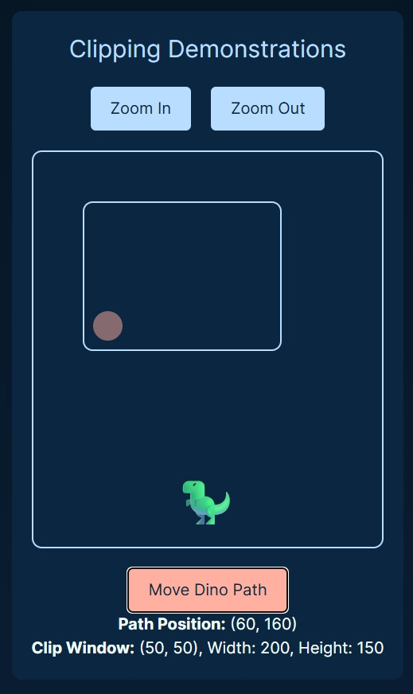

# dino graphics
a jurassic world–themed graphics learning arena.  
designed for interactive exploration of computer graphics.

---

## what it is  
this was built as a course project for computer graphics 
to make rendering, clipping, transformation, and projection  
feel like exploring ancient code in a digital fossil bed.

---

## what it teaches  
- intro to computer graphics  
- graphic primitives and algorithms: lines, shapes, fills  
- 2d and 3d transformations  
- projection: orthographic, perspective, axonometric...
- clipping: point, line, viewport  
- advanced topics: hidden surface, lighting, animation  

---

## my part  
i led the design of the ui/ux with every scene, button, transition.  
built three custom dinosaur models.  
and implemented the projection, clipping game, and advanced topics section.

---

## design in motion
a visual walkthrough of the dino graphics learning platform ↓

  
  
  
  
  
  
  
  
  
  
  

---

*graphics can teach, when the interface roars.* 
